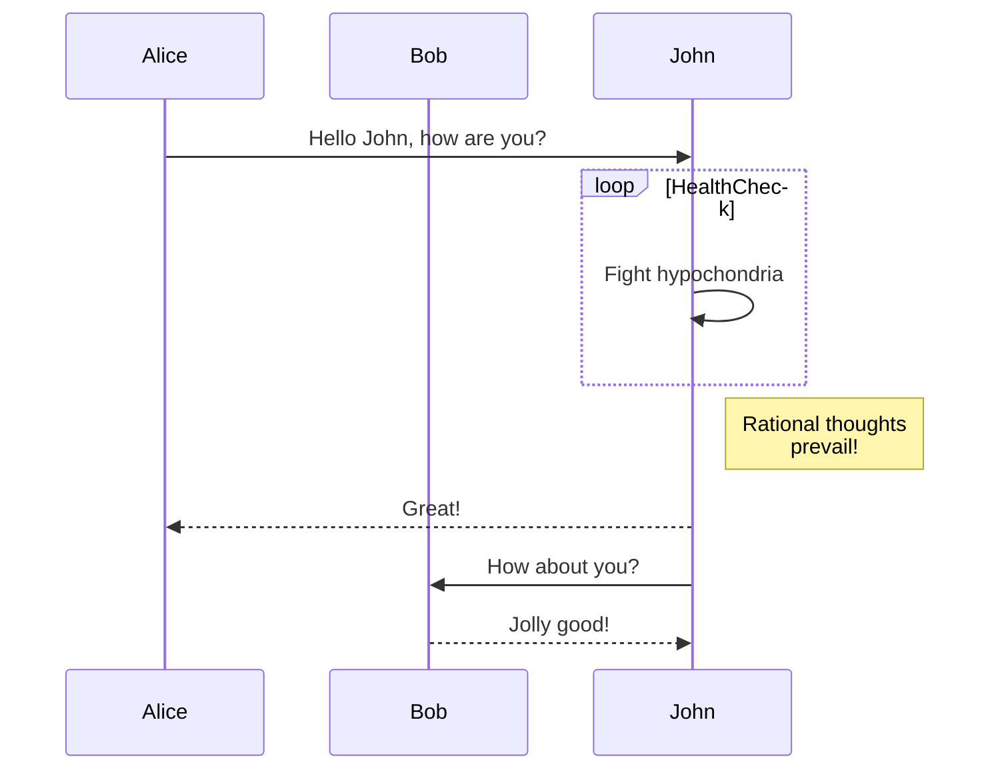
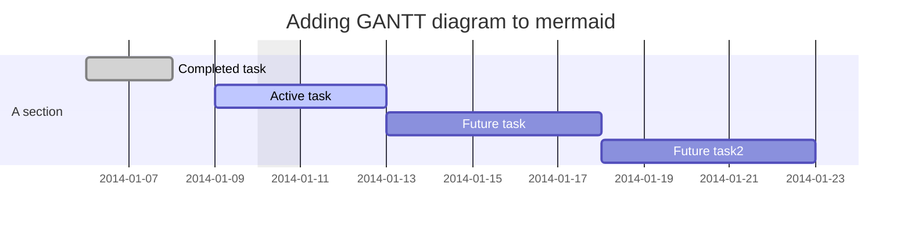
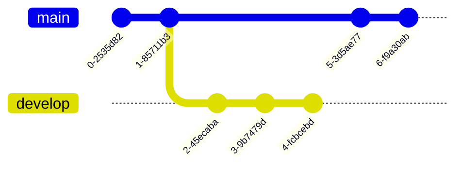

# 다이어그램 만들기 (Creating diagrams)

차트 및 그래프를 통해 정보를 전달하는 다이어그램 만들기

## 다이어그램 만들기 정보 (About creating diagrams)

Mermaid, geoJSON, topoJSON, ASCII STL의 네 가지 구문을 사용하여 Markdown으로 다이어그램을 만들 수 있습니다. 다이어그램 렌더링은 GitHub Issues, GitHub Discussions, 끌어오기 요청, wiki 및 Markdown 파일에서 사용할 수 있습니다.

## Mermaid 다이어그램 만들기 (Creating Mermaid diagrams)

Mermaid는 Markdown에서 영감을 받은 도구로, 텍스트를 다이어그램으로 렌더링합니다. 예를 들어 Mermaid는 순서도, 시퀀스 다이어그램, 원형 차트 등을 렌더링할 수 있습니다. 자세한 정보는 [Mermaid 설명서](https://mermaid-js.github.io/mermaid/#/)를 참조하세요.

Mermaid 다이어그램을 만들려면 `mermaid` 언어 식별자를 사용하여 펜싱된 코드 블록 내에 Mermaid 구문을 추가합니다. 코드 블록 만들기에 대한 자세한 정보는 [코드 블록 만들기 및 강조 표시](https://docs.github.com/ko/get-started/writing-on-github/working-with-advanced-formatting/creating-and-highlighting-code-blocks)을(를) 참조하세요.

예를 들어 값과 화살표를 지정하여 흐름도를 만들 수 있습니다.

````markdown
Here is a simple flow chart:


````


> [!NOTE]  
> GitHub에서 Mermaid 구문을 사용할 때 타사 Mermaid 플러그인을 실행하면 오류가 발생할 수 있습니다.

### Mermaid 버전 확인 (Checking your version of Mermaid)

GitHub이(가) Mermaid 구문을 지원하는지 확인하려면 현재 사용 중인 Mermaid 버전을 확인합니다.

To ensure  supports your Mermaid syntax, check the Mermaid version currently in use.

````markdown
```mermaid
  info
```
````

```mermaid
  info
```

## Creating GeoJSON and TopoJSON maps

You can use GeoJSON or TopoJSON syntax to create interactive maps. To create a map, add GeoJSON or TopoJSON inside a fenced code block with the `geojson` or `topojson` syntax identifier. For more information, see [AUTOTITLE](/get-started/writing-on-github/working-with-advanced-formatting/creating-and-highlighting-code-blocks).



>[!NOTE] GeoJSON and TopoJSON maps are not available on subdomains of , such as `octocorp.ghe.com`.





### Using GeoJSON

For example, you can create a map by specifying coordinates.

````text
```geojson
{
  "type": "FeatureCollection",
  "features": [
    {
      "type": "Feature",
      "id": 1,
      "properties": {
        "ID": 0
      },
      "geometry": {
        "type": "Polygon",
        "coordinates": [
          [
              [-90,35],
              [-90,30],
              [-85,30],
              [-85,35],
              [-90,35]
          ]
        ]
      }
    }
  ]
}
```
````


### Using TopoJSON

For example, you can create a TopoJSON map by specifying coordinates and shapes.

````text
```topojson
{
  "type": "Topology",
  "transform": {
    "scale": [0.0005000500050005, 0.00010001000100010001],
    "translate": [100, 0]
  },
  "objects": {
    "example": {
      "type": "GeometryCollection",
      "geometries": [
        {
          "type": "Point",
          "properties": {"prop0": "value0"},
          "coordinates": [4000, 5000]
        },
        {
          "type": "LineString",
          "properties": {"prop0": "value0", "prop1": 0},
          "arcs": [0]
        },
        {
          "type": "Polygon",
          "properties": {"prop0": "value0",
            "prop1": {"this": "that"}
          },
          "arcs": [[1]]
        }
      ]
    }
  },
  "arcs": [[[4000, 0], [1999, 9999], [2000, -9999], [2000, 9999]],[[0, 0], [0, 9999], [2000, 0], [0, -9999], [-2000, 0]]]
}
```
````


For more information on working with `.geojson` and `.topojson` files, see [AUTOTITLE](/repositories/working-with-files/using-files/working-with-non-code-files#mapping-geojson-files-on-github).

## Creating STL 3D models

You can use ASCII STL syntax directly in markdown to create interactive 3D models. To display a model, add ASCII STL syntax inside a fenced code block with the `stl` syntax identifier. For more information, see [AUTOTITLE](/get-started/writing-on-github/working-with-advanced-formatting/creating-and-highlighting-code-blocks).

For example, you can create a simple 3D model:

````text
```stl
solid cube_corner
  facet normal 0.0 -1.0 0.0
    outer loop
      vertex 0.0 0.0 0.0
      vertex 1.0 0.0 0.0
      vertex 0.0 0.0 1.0
    endloop
  endfacet
  facet normal 0.0 0.0 -1.0
    outer loop
      vertex 0.0 0.0 0.0
      vertex 0.0 1.0 0.0
      vertex 1.0 0.0 0.0
    endloop
  endfacet
  facet normal -1.0 0.0 0.0
    outer loop
      vertex 0.0 0.0 0.0
      vertex 0.0 0.0 1.0
      vertex 0.0 1.0 0.0
    endloop
  endfacet
  facet normal 0.577 0.577 0.577
    outer loop
      vertex 1.0 0.0 0.0
      vertex 0.0 1.0 0.0
      vertex 0.0 0.0 1.0
    endloop
  endfacet
endsolid
```
````


For more information on working with `.stl` files, see [AUTOTITLE](/repositories/working-with-files/using-files/working-with-non-code-files#3d-file-viewer).


# 디이어그램 만들기

## 다이어그램 만들기 정보
Mermaid, geoJSON, topoJSON, ASCII STL의 네 가지 구문을 사용하여 Markdown으로 다이어그램을 만들 수 있습니다. 다이어그램 렌더링은 GitHub Issues, GitHub Discussions, 끌어오기 요청, wiki 및 Markdown 파일에서 사용할 수 있습니다.

## Mermaid 다이어그램 만들기
Here is a simple flow chart:







### Mermaid 버전 확인
```mermaid
  info
```

## GeoJSON 및 TopoJSON 맵 만들기

### GeoJSON 사용
```geojson
{
  "type": "FeatureCollection",
  "features": [
    {
      "type": "Feature",
      "id": 1,
      "properties": {
        "ID": 0
      },
      "geometry": {
        "type": "Polygon",
        "coordinates": [
          [
              [-90,35],
              [-90,30],
              [-85,30],
              [-85,35],
              [-90,35]
          ]
        ]
      }
    }
  ]
}
```

### TopoJSON 사용
```topojson
{
  "type": "Topology",
  "transform": {
    "scale": [0.0005000500050005, 0.00010001000100010001],
    "translate": [100, 0]
  },
  "objects": {
    "example": {
      "type": "GeometryCollection",
      "geometries": [
        {
          "type": "Point",
          "properties": {"prop0": "value0"},
          "coordinates": [4000, 5000]
        },
        {
          "type": "LineString",
          "properties": {"prop0": "value0", "prop1": 0},
          "arcs": [0]
        },
        {
          "type": "Polygon",
          "properties": {"prop0": "value0",
            "prop1": {"this": "that"}
          },
          "arcs": [[1]]
        }
      ]
    }
  },
  "arcs": [[[4000, 0], [1999, 9999], [2000, -9999], [2000, 9999]],[[0, 0], [0, 9999], [2000, 0], [0, -9999], [-2000, 0]]]
}
```

## STL 3D 모델 만들기

```stl
solid cube_corner
  facet normal 0.0 -1.0 0.0
    outer loop
      vertex 0.0 0.0 0.0
      vertex 1.0 0.0 0.0
      vertex 0.0 0.0 1.0
    endloop
  endfacet
  facet normal 0.0 0.0 -1.0
    outer loop
      vertex 0.0 0.0 0.0
      vertex 0.0 1.0 0.0
      vertex 1.0 0.0 0.0
    endloop
  endfacet
  facet normal -1.0 0.0 0.0
    outer loop
      vertex 0.0 0.0 0.0
      vertex 0.0 0.0 1.0
      vertex 0.0 1.0 0.0
    endloop
  endfacet
  facet normal 0.577 0.577 0.577
    outer loop
      vertex 1.0 0.0 0.0
      vertex 0.0 1.0 0.0
      vertex 0.0 0.0 1.0
    endloop
  endfacet
endsolid
```