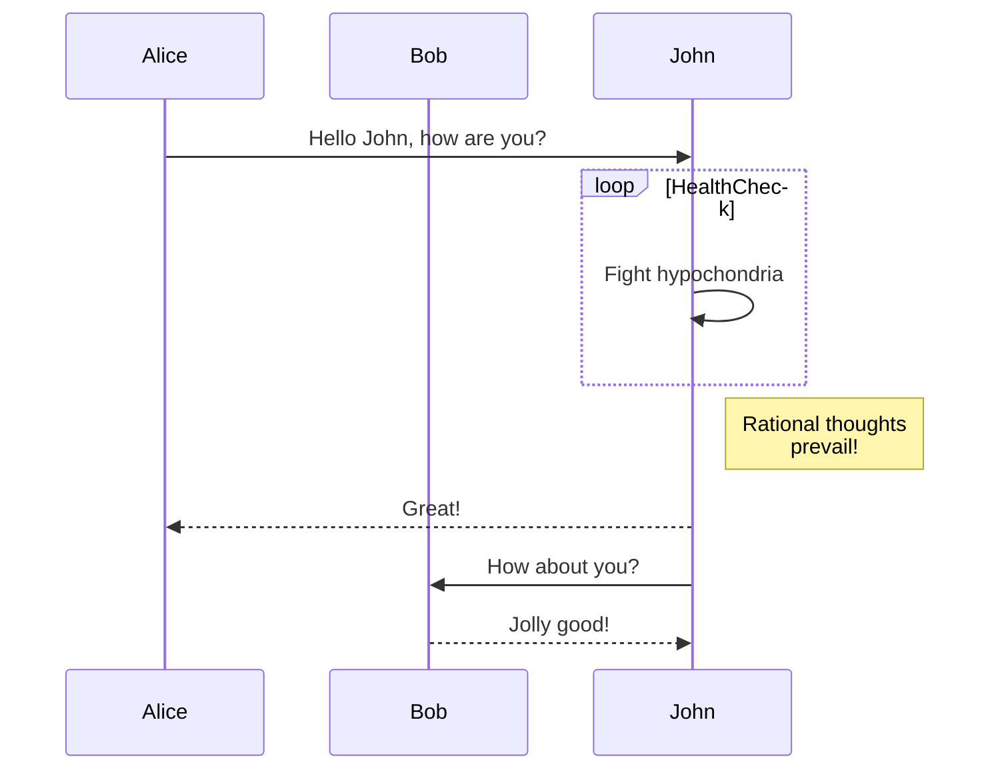
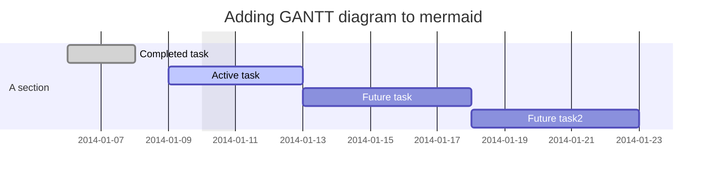
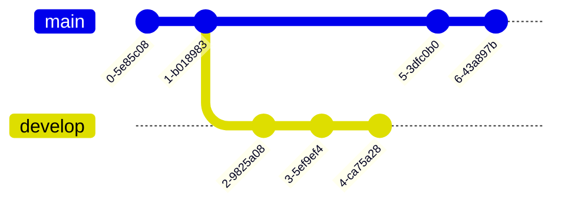

# 디이어그램 만들기

## 다이어그램 만들기 정보
Mermaid, geoJSON, topoJSON, ASCII STL의 네 가지 구문을 사용하여 Markdown으로 다이어그램을 만들 수 있습니다. 다이어그램 렌더링은 GitHub Issues, GitHub Discussions, 끌어오기 요청, wiki 및 Markdown 파일에서 사용할 수 있습니다.

## Mermaid 다이어그램 만들기
Here is a simple flow chart:







### Mermaid 버전 확인
```mermaid
  info
```

## GeoJSON 및 TopoJSON 맵 만들기

### GeoJSON 사용
```geojson
{
  "type": "FeatureCollection",
  "features": [
    {
      "type": "Feature",
      "id": 1,
      "properties": {
        "ID": 0
      },
      "geometry": {
        "type": "Polygon",
        "coordinates": [
          [
              [-90,35],
              [-90,30],
              [-85,30],
              [-85,35],
              [-90,35]
          ]
        ]
      }
    }
  ]
}
```

### TopoJSON 사용
```topojson
{
  "type": "Topology",
  "transform": {
    "scale": [0.0005000500050005, 0.00010001000100010001],
    "translate": [100, 0]
  },
  "objects": {
    "example": {
      "type": "GeometryCollection",
      "geometries": [
        {
          "type": "Point",
          "properties": {"prop0": "value0"},
          "coordinates": [4000, 5000]
        },
        {
          "type": "LineString",
          "properties": {"prop0": "value0", "prop1": 0},
          "arcs": [0]
        },
        {
          "type": "Polygon",
          "properties": {"prop0": "value0",
            "prop1": {"this": "that"}
          },
          "arcs": [[1]]
        }
      ]
    }
  },
  "arcs": [[[4000, 0], [1999, 9999], [2000, -9999], [2000, 9999]],[[0, 0], [0, 9999], [2000, 0], [0, -9999], [-2000, 0]]]
}
```