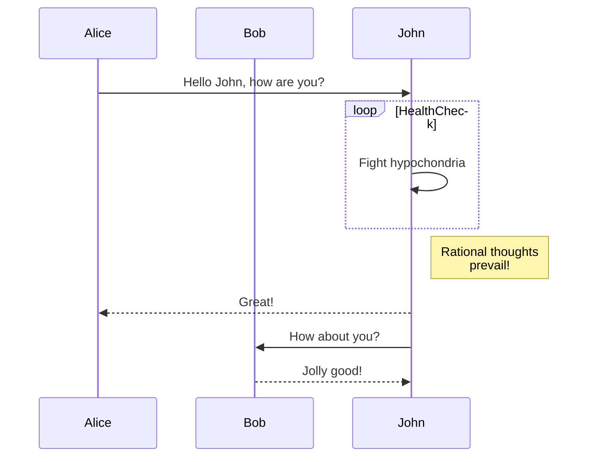
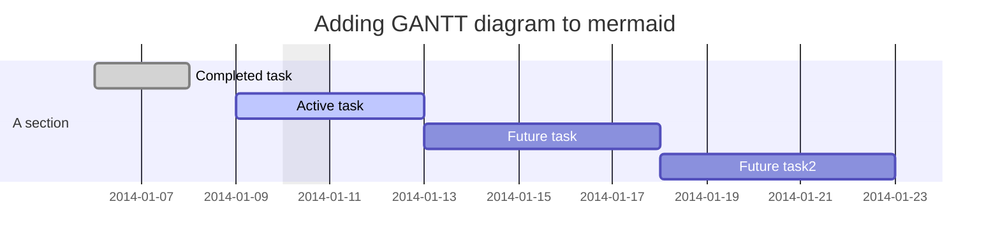

# 디이어그램 만들기

## 다이어그램 만들기 정보
Mermaid, geoJSON, topoJSON, ASCII STL의 네 가지 구문을 사용하여 Markdown으로 다이어그램을 만들 수 있습니다. 다이어그램 렌더링은 GitHub Issues, GitHub Discussions, 끌어오기 요청, wiki 및 Markdown 파일에서 사용할 수 있습니다.

## Mermaid 다이어그램 만들기
Here is a simple flow chart:







### Mermaid 버전 확인
```mermaid
  info
```

